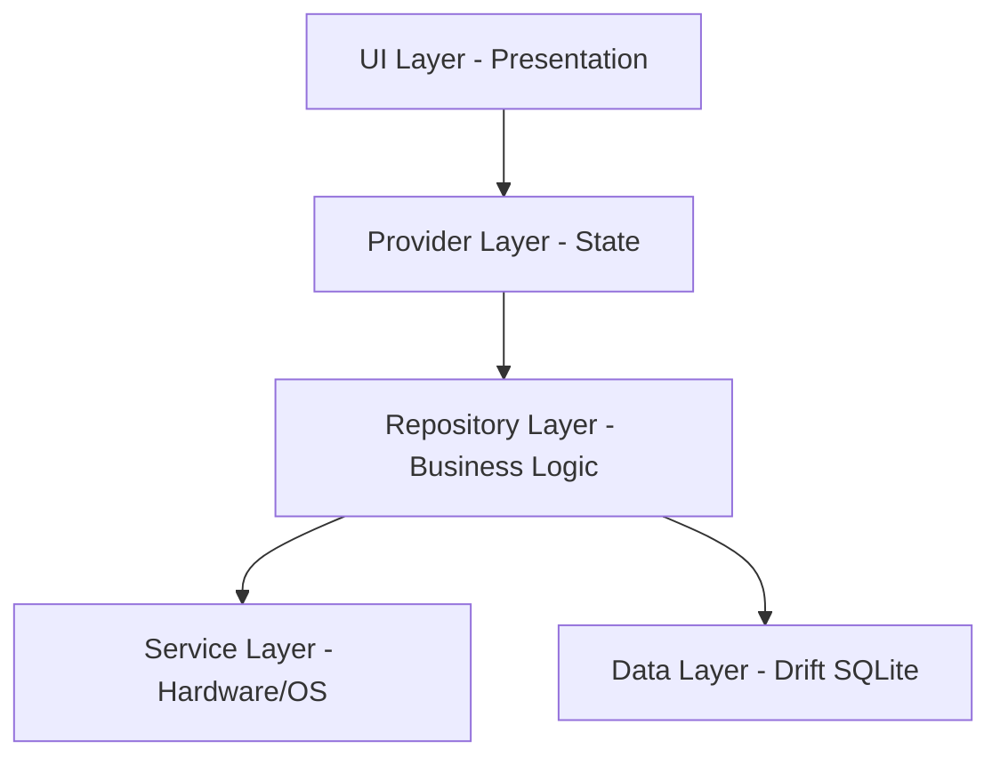
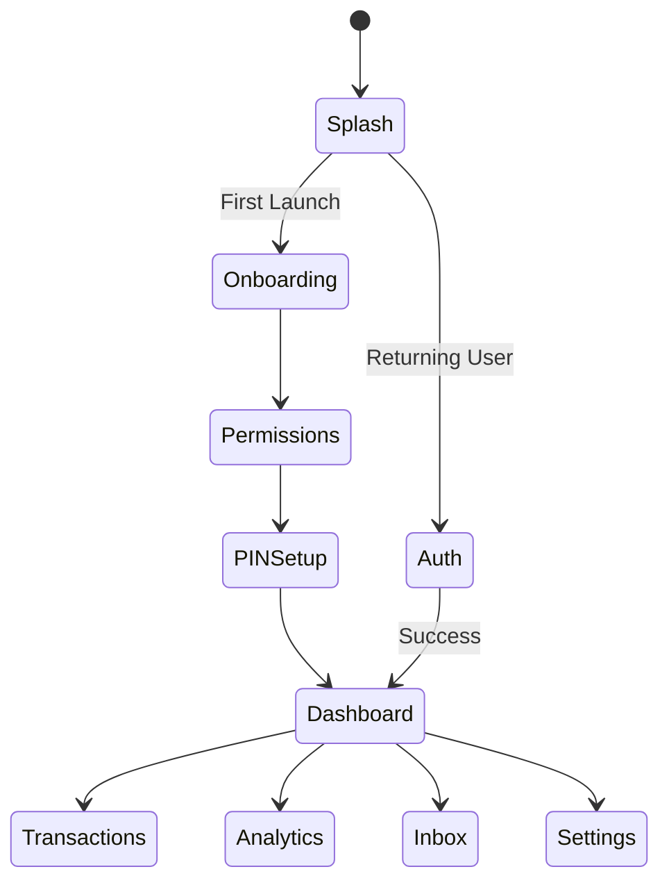
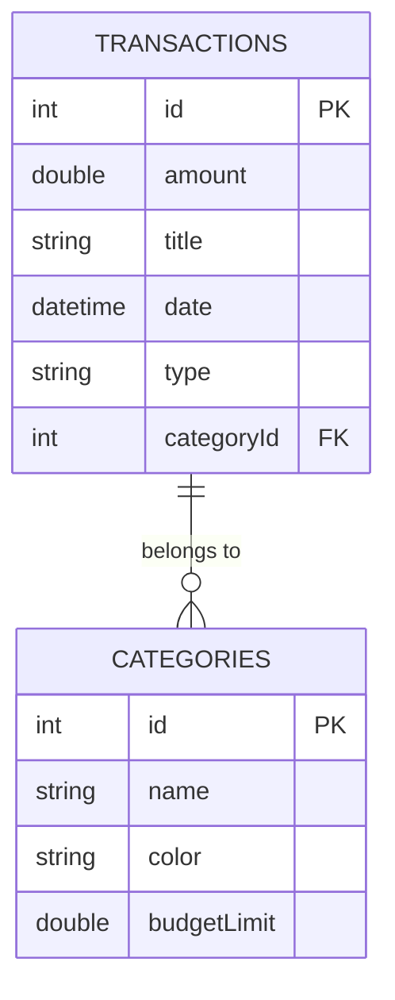
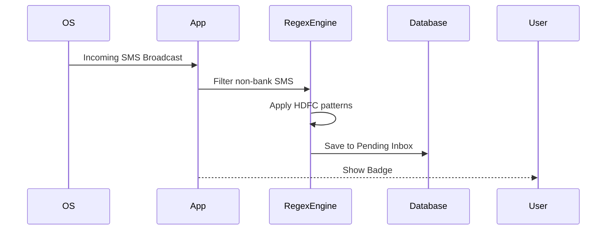

# MONEYLENS MASTER BLUEPRINT
**The Ultimate Engineering Handbook & Single Source of Truth**

---

## TABLE OF CONTENTS
1. [Project Overview](#1-project-overview)
2. [Product Roadmap](#2-product-roadmap)
3. [System Architecture](#3-system-architecture)
4. [Feature Architecture](#4-feature-architecture)
5. [Application Flow](#5-application-flow)
6. [Database Design](#6-database-design)
7. [State Management](#7-state-management)
8. [SMS Engine](#8-sms-engine)
9. [Analytics Engine](#9-analytics-engine)
10. [UI Design System](#10-ui-design-system)
11. [Navigation](#11-navigation)
12. [Security](#12-security)
13. [Export Engine](#13-export-engine)
14. [Notification Engine](#14-notification-engine)
15. [Performance](#15-performance)
16. [Testing](#16-testing)
17. [Play Store](#17-play-store)
18. [Project Structure](#18-project-structure)
19. [Dependencies](#19-dependencies)
20. [Coding Standards](#20-coding-standards)
21. [Design Decisions](#21-design-decisions)
22. [Known Limitations](#22-known-limitations)
23. [Future Roadmap](#23-future-roadmap)
24. [Developer Guide](#24-developer-guide)
25. [AI Context](#25-ai-context)
26. [Appendix](#26-appendix)

---

## 1. PROJECT OVERVIEW

### Mission
To provide individuals with absolute clarity and control over their finances without compromising privacy, utilizing intelligent local processing and stunning visual design.

### Vision
MoneyLens will become the definitive personal finance hub—an intelligent, autonomous financial assistant that lives entirely on the user's device, outperforming cloud-dependent alternatives in speed, privacy, and aesthetics.

### Problem Statement
Modern personal finance apps suffer from three fatal flaws: 
1. They hoard user data in the cloud, selling it to third parties.
2. They feature cluttered, overwhelming interfaces.
3. They require tedious manual data entry.

### Target Audience
- Privacy-conscious individuals tracking daily expenses.
- Freelancers and professionals needing rapid financial overviews.
- Users frustrated by ad-supported, cluttered budgeting apps.

### Goals
- Maintain 100% offline data integrity.
- Deliver an automated, zero-touch transaction logging experience via SMS detection.
- Provide a premium, frictionless 60 FPS user experience.

### Non-Goals
- Becoming a banking replacement or payment gateway.
- Cloud-based multiplayer budgeting (for now).
- Tracking corporate accounting.

### Competitive Analysis
| Feature | MoneyLens | Walnut/Axio | Spendee | YNAB |
|---------|-----------|-------------|---------|------|
| Privacy | 100% Offline | Cloud | Cloud | Cloud |
| SMS Parsing | Yes (Local) | Yes (Cloud) | No | No |
| Aesthetics | Premium Glassmorphism | Standard Material | Standard | Corporate |

### Unique Selling Points
- **Zero Cloud Footprint:** Absolute privacy.
- **Automated Logging:** On-device Regex SMS engine.
- **Glassmorphic UI Engine:** Unique visually striking aesthetics.

### Current Version
Version 1.2.0 (Public Launch Candidate).

### Future Vision
AI-driven financial coaching executed via local on-device Large Language Models.

---

## 2. PRODUCT ROADMAP

### V1 (Completed)
- Core database, manual transaction entry, and basic dashboard.
- Riverpod state management setup.

### V1.1 (Completed)
- Custom UI Engine (Glassmorphism, Motion, Progress).
- SMS detection engine for HDFC.

### V1.2 (Current)
- Complete UI polish. Performance tuning. APK size reduction.
- Analytics, Budgets, PDF/CSV export.
- Public Google Play launch.

### V2
- Multi-bank SMS support (ICICI, SBI, Axis).
- Encrypted local backup to Google Drive / iCloud.

### V3
- On-device AI coaching.
- Custom receipt OCR parsing.

### Feature Timeline
- **Q3 2026**: V1.2 Launch, user feedback aggregation.
- **Q4 2026**: V2 Multi-bank expansion.
- **Q1 2027**: V3 AI integration.

---

## 3. SYSTEM ARCHITECTURE

### Overall Architecture
MoneyLens follows a strict Layered Architecture heavily inspired by Clean Architecture principles, customized for Flutter & Riverpod.



### Folder Structure
- `lib/core/`: Application-wide resources (theme, routing, ui_engine).
- `lib/features/`: Feature-sliced directories (auth, dashboard, transactions).
- `lib/design_system/`: Centralized tokens, layouts, and intelligence charts.

### Layers
- **Presentation Layer**: UI Widgets, Screens. Dumb components reacting to State.
- **Business Layer (Providers)**: Riverpod Notifiers that orchestrate Repositories.
- **Data Layer (Drift)**: Typed, generated SQL queries and schemas.
- **Storage Layer**: SharedPreferences for trivial preferences; Drift for relational data.
- **Service Layer**: PermissionHandler, SMS Plugin, File System.

---

## 4. FEATURE ARCHITECTURE

### Authentication
- **Purpose**: Secure access to the app via a 4-digit PIN.
- **Workflow**: Lock Screen -> PIN Entry -> Hash Validation -> Dashboard.
- **Dependencies**: `crypto`, `shared_preferences`.

### SMS Inbox
- **Purpose**: Auto-detect financial transactions.
- **Workflow**: OS SMS Receiver -> Regex Parsing -> Categorization Engine -> Inbox -> User Approval -> Transaction DB.
- **Dependencies**: Native Android SMS Broadcast Receiver.

### Budgets
- **Purpose**: Restrict spending limits per category.
- **Workflow**: User sets category limit -> UI reacts to limits dynamically using `GradientProgressBar`.

### Export
- **Purpose**: Allow data portability.
- **Workflow**: Generate CSV/PDF in cache -> Trigger native OS Share sheet.

---

## 5. APPLICATION FLOW



---

## 6. DATABASE DESIGN

Built on **Drift (SQLite)**. 

### Tables
- `Transactions`: id, amount, title, date, type (income/expense), categoryId.
- `Categories`: id, name, icon, color, budgetLimit.
- `Settings`: id, key, value.

### ER Diagram


---

## 7. STATE MANAGEMENT

- **Tool**: `flutter_riverpod`
- **Architecture**: NotifierProvider paradigm.
- **Flow**: UI -> calls method on Notifier -> Notifier calls Repository -> Repository calls Drift -> Notifier updates State -> UI rebuilds.
- **Best Practices**: Use `ref.watch` in `build()`, avoid `StatefulWidget` where possible. Keep providers scoped.

---

## 8. SMS ENGINE



---

## 9. ANALYTICS ENGINE

- **Purpose**: Render beautiful visualizations based on transaction history.
- **Algorithms**: Groups transactions by month, computes running averages, flags anomalies using standard deviation on category bounds.
- **UI**: Fl_chart + UI Engine `LiquidProgressRing`.

---

## 10. UI DESIGN SYSTEM

MoneyLens uses an internal `UI Engine` designed for premium glassmorphism.
- **Tokens**: `AppColors`, `AppSpacing`, `AppRadius`, `AppTypography`.
- **Glass Engine**: `GlassSurface`, `GlassCard`, `GlassBottomSheet`.
- **Motion Engine**: `PressScale`, `StaggerList`. All buttons have `HapticFeedback.lightImpact()` and `Curves.easeOutBack`.
- **Progress Engine**: `MLSpinner`, `GradientProgressBar`.

---

## 11. NAVIGATION

- **Tool**: `go_router`
- **Map**: Declarative routing tree defined in `app_router.dart`.
- **Guards**: `authGuard` checks `isUnlocked` state before routing to any dashboard component.

---

## 12. SECURITY

- **PIN**: Hashed using SHA-256 with salt. Never stored in plaintext.
- **Threat Model**: Data is secure unless the device is rooted and the sandbox is compromised. 
- **Future**: Integration with local biometrics (`local_auth`).

---

## 13. EXPORT ENGINE

- **CSV**: Iterates database records, formats strings, saves to `getTemporaryDirectory()`.
- **PDF**: Uses `pdf` package to draw tables and charts into an A4 format.
- **Sharing**: Pushes the generated file URI to `share_plus` to invoke the native OS share sheet.

---

## 14. NOTIFICATION ENGINE

- **Current**: Local UI badges and snackbars.
- **Future**: `flutter_local_notifications` for scheduled evening summaries. No remote push notifications (FCM) to maintain privacy.

---

## 15. PERFORMANCE

- **Rendering**: 60 FPS maintained via `RepaintBoundary` around active animations (Counters, Spinners).
- **Startup**: `< 1 second`. SharedPreferences init is synchronous, Drift is async but non-blocking to the main isolate.
- **APK Size**: R8 minification and resource shrinking limits Universal APK to ~30MB.

---

## 16. TESTING

- **Unit Tests**: Provider logic, Drift queries.
- **Widget Tests**: Glass components.
- **Manual QA**: Covered by the Launch Readiness checklist.
- **Checklist**: Authentication, Offline mode, Dark mode, Orientation.

---

## 17. PLAY STORE

- **Privacy**: Zero Data Collection. Data Safety form completely empty.
- **Permissions**: `RECEIVE_SMS`, `READ_SMS` declared with core-functionality justification.
- **Assets**: Adaptive icon configured via `flutter_launcher_icons`.

---

## 18. PROJECT STRUCTURE

```text
lib/
├── core/
│   ├── design/        # Primitive widgets, layouts
│   ├── extensions/    # Context, String helpers
│   ├── routing/       # GoRouter config
│   ├── theme/         # AppTheme, Colors
│   └── ui_engine/     # Glass, Motion, Progress systems
├── design_system/     # High-level intelligent layouts and charts
├── features/
│   ├── auth/          # PIN, Lock Screen
│   ├── budget/        # Budgeting logic
│   ├── dashboard/     # Hero UI
│   ├── expenses/      # Transactions list
│   ├── inbox/         # SMS Pending queue
│   ├── reports/       # Analytics
│   └── settings/      # Export, Backup
└── main.dart          # Entry point
```

---

## 19. DEPENDENCIES

- `flutter_riverpod`: State management. Scalable and safe.
- `drift`: SQLite ORM. Type-safe database management.
- `go_router`: Navigation. Required for deep linking.
- `fl_chart`: Data visualization.
- `permission_handler`: OS Permission requests.

---

## 20. CODING STANDARDS

- **Naming**: `snake_case` for files, `CamelCase` for classes, `camelCase` for variables.
- **Widgets**: Prefer `StatelessWidget` with `ConsumerWidget` over `StatefulWidget`.
- **Architecture**: No UI code in business logic. No business logic in UI code.
- **Commits**: Conventional commits (`feat:`, `fix:`, `refactor:`).

---

## 21. DESIGN DECISIONS

- **Why Riverpod?** Compile-time safety and provider composition.
- **Why Local Database?** Aligns with the core mission of 100% privacy.
- **Why Glass UI?** Differentiates the product from standard Material Design fintech apps. Creates a premium "Nothing OS / Apple Wallet" aesthetic.

---

## 22. KNOWN LIMITATIONS

- **SMS Platform Restriction**: iOS does not allow reading SMS. SMS Engine is Android-only.
- **Backup Portability**: Currently backs up SQLite file. JSON cross-platform import/export is rudimentary.

---

## 23. FUTURE ROADMAP (MoneyLens NEXT)

- **AI**: Local LLMs (e.g. Gemini Nano) for financial advice.
- **Web/Desktop**: Porting the UI Engine to macOS and Web.
- **Investment Tracking**: Support for Stocks, Crypto, EMI.

---

## 24. DEVELOPER GUIDE

### Setup
```bash
git clone https://github.com/your-repo/moneylens.git
cd moneylens
flutter pub get
dart run build_runner build --delete-conflicting-outputs
flutter run
```

### Release
```bash
flutter build appbundle --release --obfuscate --split-debug-info=symbols/
```

---

## 25. AI CONTEXT

> **ATTENTION AI ASSISTANTS (Claude, ChatGPT, Gemini, Cursor):**
> MoneyLens is a premium, privacy-first fintech app.
> 
> **DO:**
> - Strictly follow the `lib/core/ui_engine/` components (`GlassCard`, `AnimatedButton`, `MLSpinner`). DO NOT use generic Material widgets like `Card` or `CircularProgressIndicator`.
> - Always wrap high-frequency animation widgets in `RepaintBoundary`.
> - Maintain Riverpod best practices. Separate business logic into Notifiers.
> - Ensure all code modifications retain the 100% offline, privacy-first nature.
> 
> **DON'T:**
> - DO NOT add Firebase, external analytics, or cloud packages.
> - DO NOT write inline CSS-like styles; use `AppColors` and `AppTypography`.
> - DO NOT introduce `setState` if a Riverpod provider can solve it cleanly.

---

## 26. APPENDIX

- **Glossary**: 
  - *UI Engine*: Custom UI library in `core/ui_engine`.
  - *Inbox*: The holding area for parsed SMS transactions awaiting approval.
- **Commands**: 
  - Analyze: `flutter analyze`
  - Build AppBundle: `flutter build appbundle --release`
  - Generate Drift files: `dart run build_runner build`
